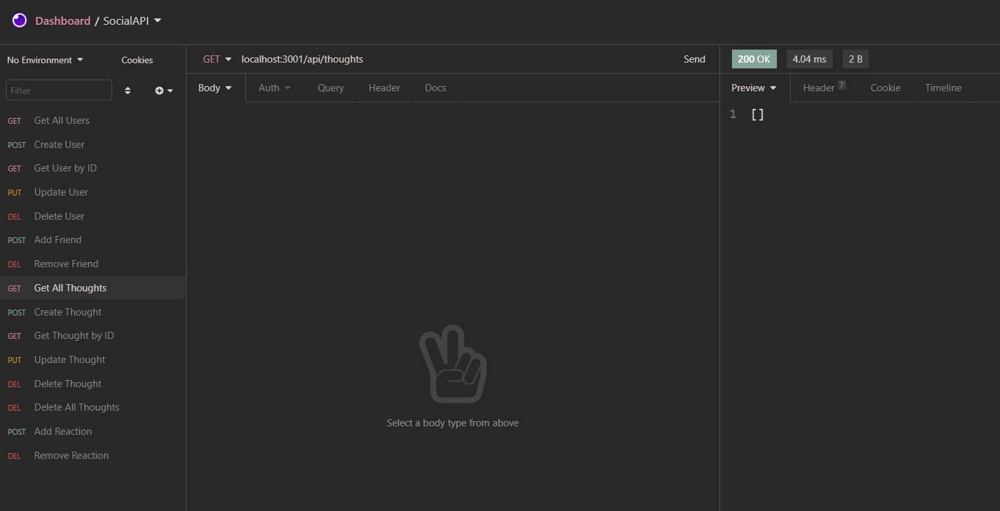

# SocialAPI

## Description

RESTful API for a thoughtful social network application.
## Table of Contents
* [Installation](#Installation)
* [Usage](#Usage)
* [License](#License)
* [Contributing](#Contributing)
* [Tests](#Tests)
* [Questions](#Questions)
## Installation
Download files.  Run npm install. Install MongoDB. Install API client, I recommend Insomnia.
## Usage
Start server using node server command. Use API client to perform CRUD operations.
## License
This project is covered under the MIT license.
## Contributing
N/A
## Tests
N/A
## Questions
GitHub: [github.com/stephenbeiter](http://github.com/stephenbeiter)  
Email: [stephenbeiter@gmail.com](mailto:stephenbeiter@gmail.com)
## Created by
### Stephen Beiter
